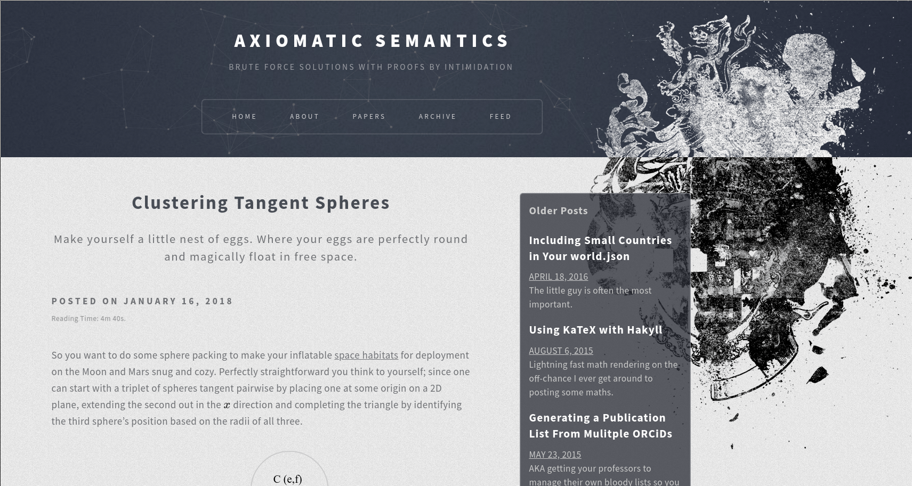
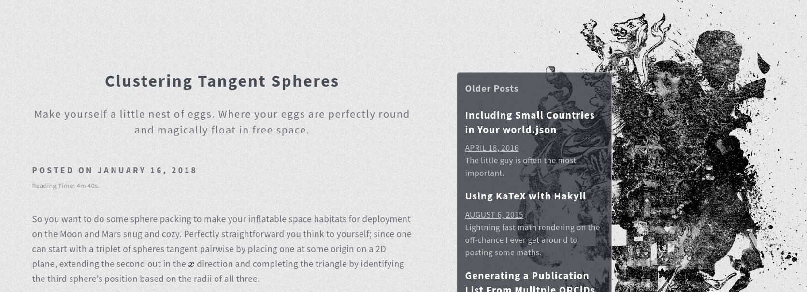

After 4 years of bloging with Hakyll and the theme lying herein I've decided to move on and archive this repository.

Hakyll was, and still is an excellent tool for static site generation, and an excellent hands on teacher for Haskell.
Haskell itself is a really cool language with great potential, but my personal experiences fighting cabal and dependency chains has slowly chipped away at my want to become more familiar with Haskell as a whole.
The runoff of this means I started to fight with implementation of features and ultimately failed to extend this blog in ways I wished to over the years.
I'd usually consider a theme revamp by about this time anyway, but have ultimately admitted defeat with my Haskell education and will rebuild this blog with [Gutenberg](https://github.com/Keats/gutenberg).

## Notable features of this setup

With that being said, a number of features of this Hakyll setup and theme are still interesting, and those of you who want to run your own sites using Hakyll may want to take a look at the code here.

- Code syntax highlighting using `pygments` gives a much richer experience than `Kate`.
- Pagination: something I haven't seen setup on many Hakyll blogs.
- `KaTeX` integration, which can be turned on and off using a frontmatter variable.
- Extended `pandoc` reader options not accessible under normal conditions.
- An interesting (or perhaps overly complicated) blurb & front page setup, with a single complete article and two summaries on the index.

The theme had a few things that were fashionable in the design circles 4 years back, but not too much of note there nowadays.
However, I still really like the black/white transition of the background motif:

---

These files generate my [blog](http://axiomatic.neophilus.net) using [Hakyll](http://jaspervdj.be/hakyll/), a static site generator written in Haskell.

This code is distributed under the [MIT License](http://opensource.org/licenses/MIT).

## TODO

* [x] Fix pagination which broke from hakyll 4.5.4
* [ ] There's a bug somewhere in the js serving the page size. Ultra high res seems to be classified as tablet size?
* [ ] Sort out the error pages rather than nginx defaults
